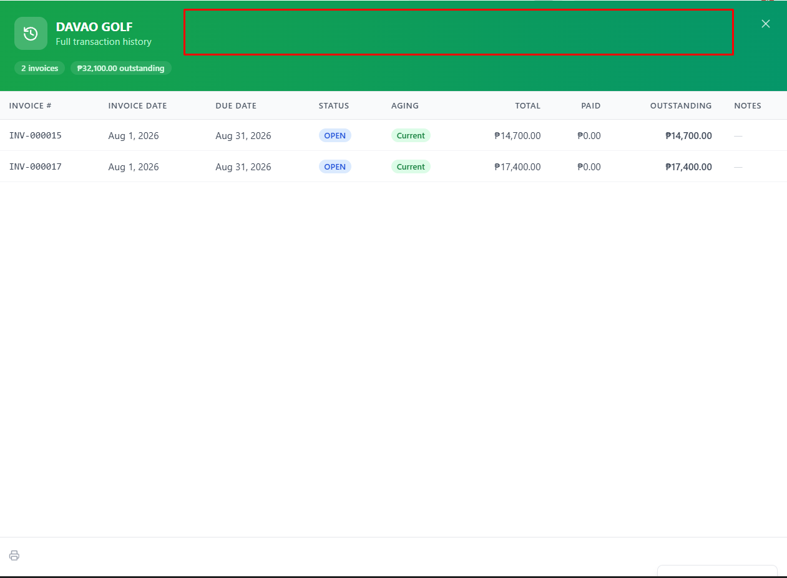

# Settings → Inquiries Tab (View-Only) — Design

**Date:** 2026-07-15
**Status:** Approved

## Goal

Give ADMIN/MANAGER users a place inside the ERP to read the messages/inquiries
submitted through the Finara marketing landing page contact form. Today those
leads land in the MySQL `Lead` table (and are optionally forwarded to the
configured webhook), but there is no UI to view them.

## Decision

Add a new **Inquiries** tab to the existing tab-based Settings page
(`app/(dashboard)/settings/page.jsx`) — view-only, no status management.
Chosen over a separate `/settings/inquiries` route or a top-level nav entry
because the Settings page already hosts role-gated tabs (Users, Database,
Audit Trail) and the user asked for it under Settings.

## Scope

- **No backend changes.** Uses the existing `GET /api/leads` endpoint
  (authenticated, `authorize('ADMIN', 'MANAGER')`, sorted newest first) and
  the existing `leads.list()` helper in `lib/api.js`.
- New `TABS` entry: `{ key: 'inquiries', label: 'Inquiries', icon: Inbox,
  roles: ['ADMIN', 'MANAGER'] }` — mirrors the API's role gate.
- Tab content:
  - Table (`table-wrapper` / `table` classes, same as Users tab) with columns:
    Date, Name, Company, Email, Phone, Message, Status.
  - Status rendered as a badge: NEW = `badge-blue`, CONTACTED = `badge-yellow`,
    CLOSED = `badge-green`.
  - Long messages truncated in the row; clicking the row expands it to show
    the full message.
  - Refresh button to re-fetch.
  - Empty state: "No inquiries yet" when the table is empty.
- Data is loaded lazily when the tab is activated (same pattern as the
  Users/Database/Permissions tabs).

## Out of Scope (YAGNI)

- Status updates (mark contacted/closed), delete, reply, export.
- Pagination/filtering — volume is expected to be low; revisit if needed.
